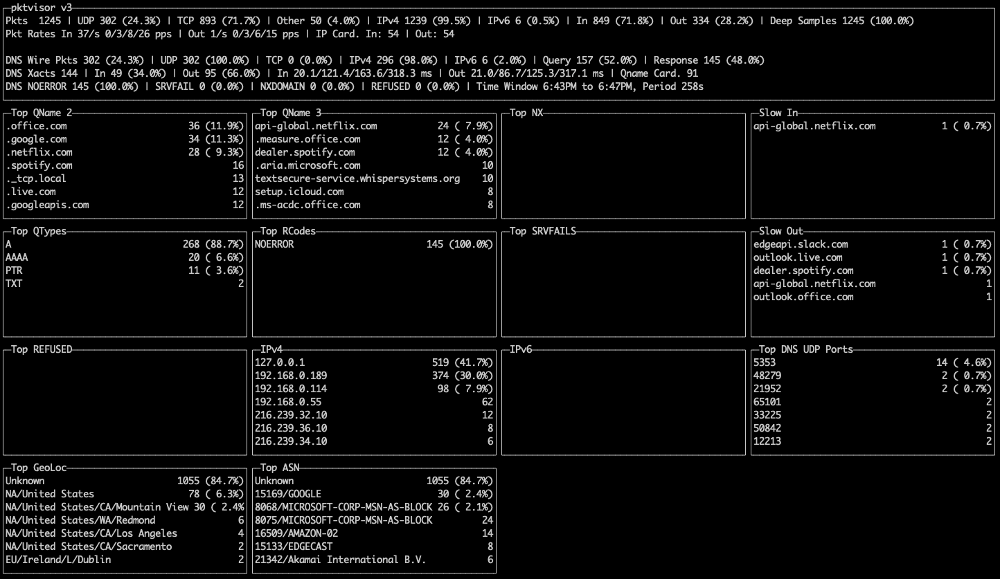

> This project is in [active development](https://github.com/ns1/community/blob/master/project_status/ACTIVE_DEVELOPMENT.md).


[](https://lgtm.com/projects/g/ns1/pktvisor/alerts/)
[](https://scan.coverity.com/projects/ns1-pktvisor)

<p align="left">
  <strong>
    <a href="#what-is-pktvisor">Introduction<a/>&nbsp;&nbsp;&bull;&nbsp;&nbsp;
    <a href="#get-started">Get Started<a/>&nbsp;&nbsp;&bull;&nbsp;&nbsp;
    <a href="#docs">Docs<a/>&nbsp;&nbsp;&bull;&nbsp;&nbsp;
    <a href="#contact-us">Contact Us<a/>&nbsp;&nbsp;&bull;&nbsp;&nbsp;
    <a href="#building">Building<a/>&nbsp;&nbsp;&bull;&nbsp;&nbsp;
    <a href="#contribute">Contribute<a/>&nbsp;&nbsp;&bull;&nbsp;&nbsp;
    <a href="#faq">FAQ<a/>
  </strong>
</p>

## What is pktvisor?

pktvisor (pronounced "packet visor") is an observability tool for _summarizing_ high volume, information overloaded data
streams directly at the edge. Its goal is to extract the useful signal from the less useful noise; to separate the
needles from the haystacks as close to the source as possible. This results in lightweight, immediately actionable
observability data.

It is a resource efficient, side-car style agent built from the ground up to be dynamically controlled in real time via
API. Its output is useful both on-node via command line (for a localized, hyper real-time view) as well as centrally
collected into industry standard observability stacks like Prometheus and Grafana.

The modular input stream system is designed to _tap into_ data streams, and currently focuses
on [packet capture](https://en.wikipedia.org/wiki/Packet_analyzer) but will soon support additional taps such
as [sFlow](https://en.wikipedia.org/wiki/SFlow) / [Netflow](https://en.wikipedia.org/wiki/NetFlow)
, [dnstap](https://dnstap.info/), [envoy taps](https://www.envoyproxy.io/docs/envoy/latest/operations/traffic_tapping),
and [eBPF](https://ebpf.io/).

The modular, real-time stream processor includes full application level analysis, and typically summarizes to one minute
buckets of:

* Counters
* Histograms
* Timers
* Heavy Hitters/Frequent Items/Top N
* Cardinality
* Rates

These screenshots display both the command line and centralized views of
the [Network](https://github.com/ns1/pktvisor/tree/master/src/handlers/net)
and [DNS](https://github.com/ns1/pktvisor/tree/master/src/handlers/dns) stream processors, and the types of summary
information provided:




## Docs

REST API documentation, including a description of the metrics that are available, is available in OpenAPI format. See
the `docs/` directory.

## Get Started

The easiest way to get started with pktvisor is to use
the [public docker image](https://hub.docker.com/r/ns1labs/pktvisor). The image contains the command line
UI (`pktvisor-cli`), the pcap file analyzer (`pktvisor-pcap`), and the collector daemon (`pktvisord`).

1. *Pull the container*

```
docker pull ns1labs/pktvisor
``` 

2. *Start the collector daemon*

This will run in the background and stay running. Note that the final two arguments request `pktvisord` binary (with the
final 'd' for daemon), and to packet capture on the `any` ethernet interface. You may substitute that for a known
interface on your device. Note that this requires docker host networking to observe traffic outside the container:

```
docker run --rm --net=host -d ns1labs/pktvisor pktvisord any
```

3. *Run the command line UI*

After the collector is running, you can visualize results locally with the included UI. This command will run the
command line UI (`pktvisor-cli`) in the foreground, and exit when Ctrl-C is pressed
```
docker run -it --rm --net=host ns1labs/pktvisor pktvisor-cli
```

See usage examples below for more complex scenarios, including specification of the local host IP(s) and Geo support.

There are currently no prebuilt operating system packages. If you would like to build your own executable,
please see the Build section below.

Collector Daemon Usage
---

A collector daemon should be installed on each node to be monitored.

Current command line options are described with:

```
pktvisord --help
```

```

    Usage:
      pktvisord [options] [IFACE]
      pktvisord (-h | --help)
      pktvisord --version

    pktvisord summarizes data streams and exposes a REST API control plane for configuration and metrics.

    IFACE, if specified, is either a network interface or an IP address (4 or 6). If this is specified,
    a "pcap" input stream will be automatically created, with "net" and "dns" handler modules attached.
    ** Note that this is deprecated; you should instead use --full-api and create the pcap input stream via API.

    Base Options:
      -l HOST               Run webserver on the given host or IP [default: localhost]
      -p PORT               Run webserver on the given port [default: 10853]
      --full-api            Enable full REST API giving complete control plane functionality [default: false]
                            When not specified, the exposed API is read-only access to summarized metrics.
                            When specified, write access is enabled for all modules.
      -h --help             Show this screen
      -v                    Verbose log output
      --version             Show version
      --geo-city FILE       GeoLite2 City database to use for IP to Geo mapping (if enabled)
      --geo-asn FILE        GeoLite2 ASN database to use for IP to ASN mapping (if enabled)
    Handler Module Defaults:
      --max-deep-sample N   Never deep sample more than N% of streams (an int between 0 and 100) [default: 100]
      --periods P           Hold this many 60 second time periods of history in memory [default: 5]
    pcap Input Module Options (deprecated, use full-api instead):
      -b BPF                Filter packets using the given BPF string
      -H HOSTSPEC           Specify subnets (comma separated) to consider HOST, in CIDR form. In live capture this /may/ be detected automatically
                            from capture device but /must/ be specified for pcaps. Example: "10.0.1.0/24,10.0.2.1/32,2001:db8::/64"
                            Specifying this for live capture will append to any automatic detection.

```

Command Line UI Usage
---

The command line UI (`pktvisor-cli`) connects to a collector daemon to visualize the real time stream summarization. It
can connect to a local or remote agent.

Advanced Collector Daemon Usage Examples
---

Starting the collector daemon from Docker with MaxmindDB and Host options:

```
docker run --rm --net=host -d --mount type=bind,source=/opt/geo,target=/geo ns1labs/pktvisor pktvisord --geo-city /geo/GeoIP2-City.mmdb --geo-asn /geo/GeoIP2-ISP.mmdb -H 192.168.0.54/32,127.0.0.1/32 any
```

## Contact Us

[Join us on Slack](https://join.slack.com/t/getorb/shared_invite/zt-nn4joou9-71Bp3HkubYf5Adh9c4cDNw)

Centralized Collection
---

pktvisor may be collected centrally to give a global view of the collected information.

Host Concept
---
Ingress and egress (in/out) related metrics can only be calculated if the agent understands how to identify the host.

Build Dependencies
---

* CMake >= 3.8
* Linux or OSX
* C++ compiler supporting C++17
* PcapPlusPlus https://github.com/ns1/PcapPlusPlus
* Conan C++ package manager
* MaxMind DB libmaxmindb

Running/Debugging Integration Tests:

* jq
* graphtage

Building
---

Building is based on CMake.

Default build:

```
mkdir build; cd build
conan install ..
cmake ..
make
```

Building the docker image (from the root project directory):
```
org="myorg"
image="mypktvisor"
tag="latest"
docker build -t ${org}/${image}:${tag} -f docker/Dockerfile .
```

Contributions
---
Pull Requests and issues are welcome. See the [NS1 Contribution Guidelines](https://github.com/ns1/community) for more information.

License
---
This code is released under Mozilla Public License 2.0. You can find terms and conditions in the LICENSE file.
